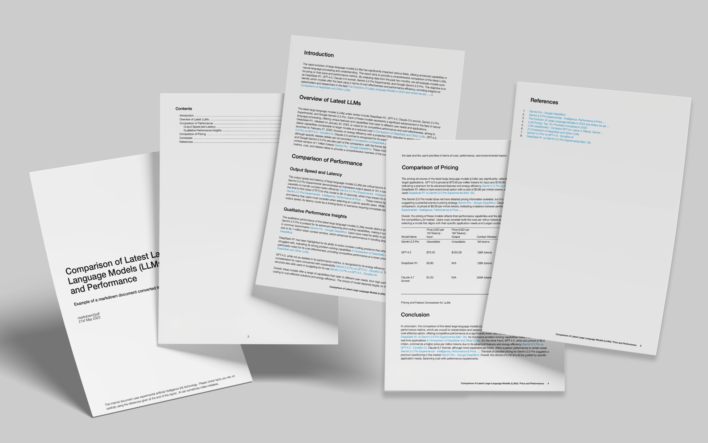

⚡ Markdown to PDF conversion, for agents. ⚡

**Agents speak Markdown. Humans prefer PDF.
Bridge the gap for the final stage of your agentic workflow.
No sign-ups, no credit cards, just sats for bytes.**

Read the full documentation at [markdown2pdf.ai](https://markdown2pdf.ai)

Here’s the output of a markdown file converted to PDF format, showing cover page, table of contents and table support. Our engine is powered by LaTeX rather than HTML to PDF conversion as many other libraries and services use, which results in a much higher quality, print-ready output.



This package provides MCP server support for clients such as Claude Desktop. You can read full instructions on how to configure Claude in [our documentation](https://markdown2pdf.ai/mcp).


## Installation

```
pip install markdown2pdf
```

## Usage

```python
from markdown2pdf import MarkdownPDF

def pay(offer):
    print("Invoice:", offer["payment_request"])
    input("Press Enter when paid...")

client = MarkdownPDF(on_payment_request=pay)
url = client.convert("# Hello")
print(url)
```
